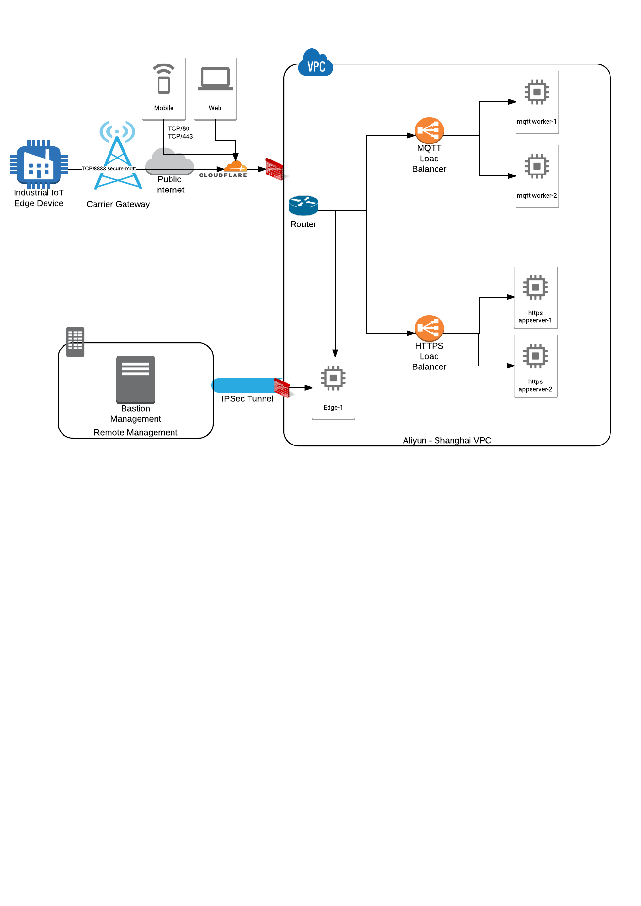

# terraform-iot-aliyun
Example terraform for an IoT project in Aliyun cloud

## Description
The example launches an example IoT project such as a VPC, VSwitch, NAT gateway, ECS, SecurityGroups. You may want to explore the "minimal" terraform first, and then try the full project in "main"

### Minimal 

This is a minimal "all in one" configuration to familiarize yourself with terraform.

* Set up environment and Navigate to minimal

        # Download terraform and place in /usr/bin/ or somewhere on PATH
        export ALICLOUD_ACCESS_KEY="your_aliyun_access_key"
        export ALICLOUD_SECRET_KEY="your_aliyun_secret_key"
        export ALICLOUD_REGION="cn-shanghai" 
        cd minimal

* See what terraform is going to do
        
        terraform plan

* Apply terraform 

        terraform apply

* Destroy the example

        terraform destroy -force

### Get up and running

The cluster is controlled from the "main" folder:

* Navigate to main

        cd main

* Initialize phase

        terraform init

* Get phase
		
        terraform get

* Planning phase

		terraform plan 
    		
* Apply phase

		terraform apply 
		   
* Destroy (Dangerous! Will destroy everything it knows about) 

		terraform destroy

* Forget Everything (Dangerous! Will forget everything it knows)
		
        rm -rf .terraform terraform.tfstate*

